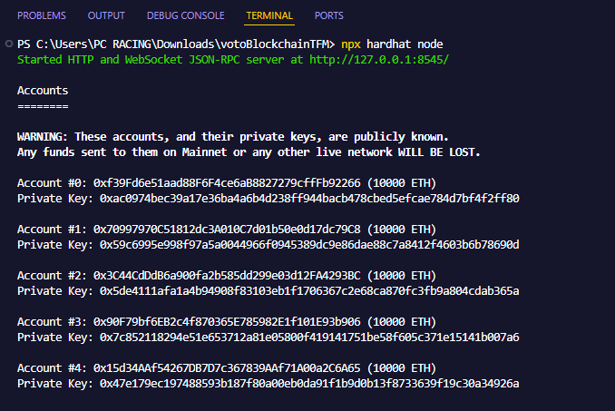
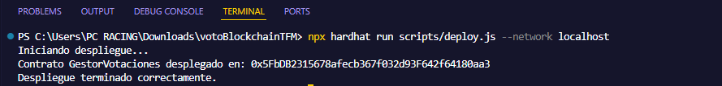
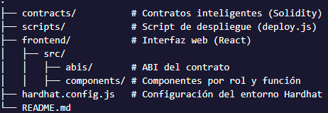
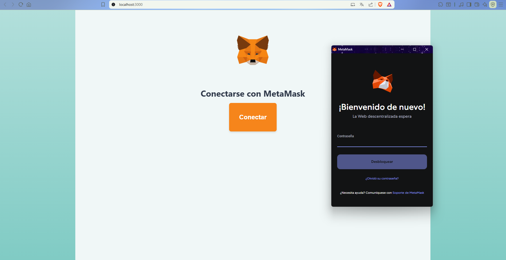
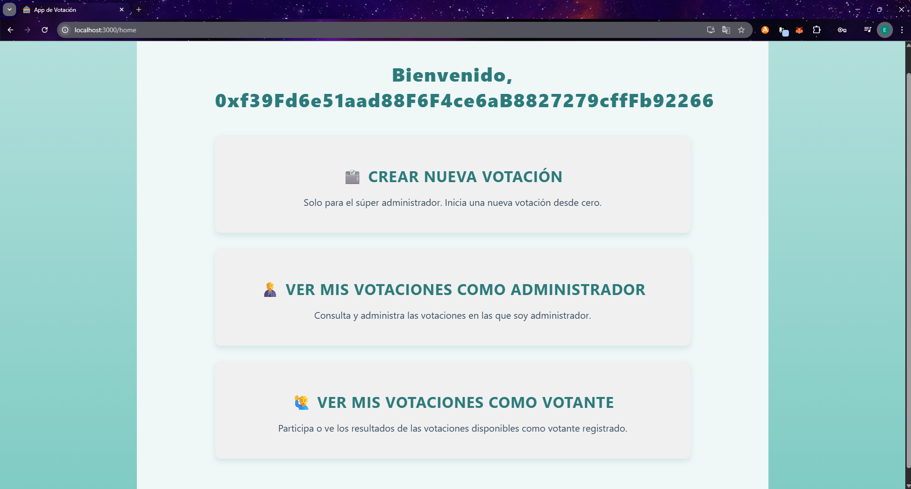
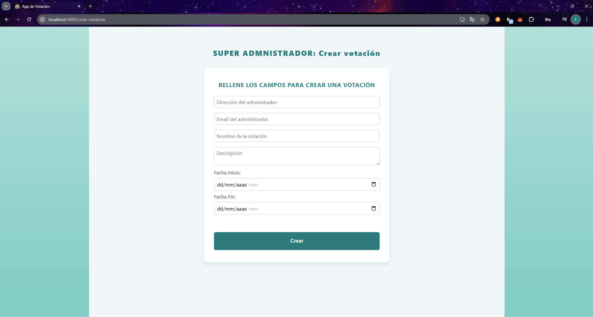
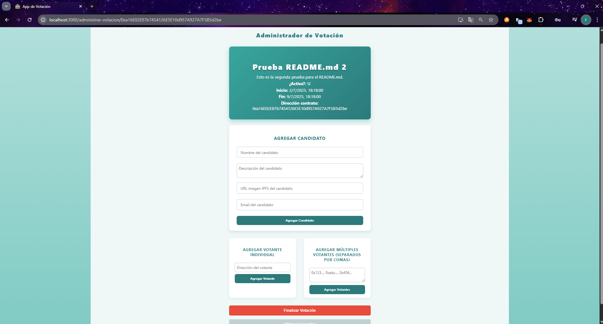
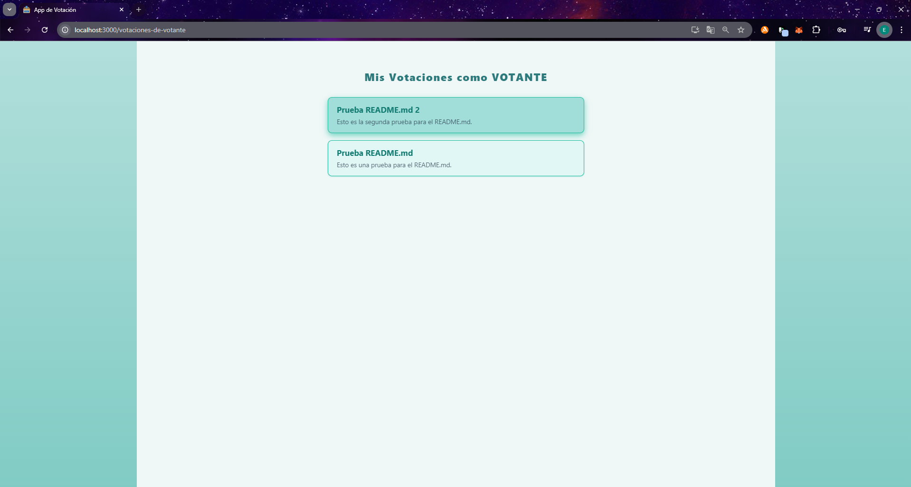
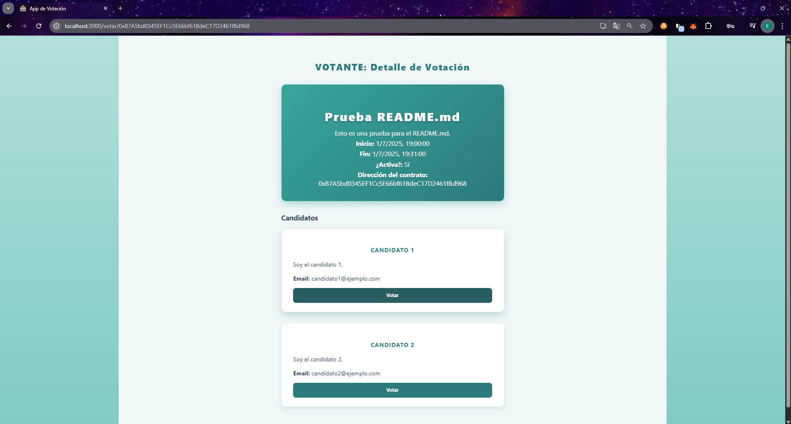

# 🗳️ Voting DApp - Sistema de Votación Descentralizado en Ethereum

Este proyecto consiste en una aplicación descentralizada (DApp) de votación electrónica construida como parte de un Trabajo de Fin de Estudios. La solución permite crear votaciones, registrar candidatos y votantes, y emitir votos de manera segura y transparente mediante el uso de **blockchain**, contratos inteligentes escritos en **Solidity**, y una interfaz web con **React**.

El objetivo principal es ofrecer un sistema sencillo pero seguro, sin necesidad de credenciales tradicionales, aprovechando la identidad pública de Ethereum como mecanismo de autenticación descentralizada.

---

## 🚀 Tecnologías Utilizadas

- **Solidity** — Lenguaje para contratos inteligentes.
- **Hardhat** — Entorno de desarrollo para Ethereum.
- **Ethers.js** — Librería de conexión blockchain desde el frontend.
- **React.js** — Interfaz de usuario dinámica.
- **MetaMask** — Wallet del usuario para firmar transacciones.

---

## ⚙️ Requisitos previos

Antes de ejecutar el proyecto, asegúrate de tener instalado:

- [Node.js (v18.x recomendado)](https://nodejs.org/)
- [MetaMask](https://metamask.io/download/)
- [Hardhat](https://hardhat.org/getting-started/)

---

## 📦 Instalación del proyecto

Clona este repositorio y accede a la carpeta del proyecto:

```bash
git clone https://github.com/tu-usuario/tu-repo.git
cd tu-repo
```

## 📦 Instalación del frontend

Instala las dependencias del frontend:

```bash
cd frontend
npm install
```

## 🧪 Ejecución del entorno de desarrollo local

1. Inicia la red local de Ethereum con Hardhat
Desde la raíz del proyecto:

```bash
npx hardhat node
```

Esto ejecutará una red blockchain local y mostrará 20 cuentas con ETH de prueba. Verás algo similar a:



2. Despliega los contratos inteligentes
Abre otra terminal (también desde la raíz del proyecto):

```bash
npx hardhat run scripts/deploy.js --network localhost
```

Esto desplegará el contrato en la red local de Hardhat. Verás en la consola algo como:



3. Arranca la aplicación web (frontend)

```bash
cd frontend
npm start
```

La aplicación estará disponible en: http://localhost:3000

4. Configura MetaMask
    - Abre MetaMask y conecta con la red local de Hardhat (http://127.0.0.1:8545).
    - Importa una de las cuentas usando la clave privada que aparece al ejecutar npx hardhat node.
    - Ya puedes comenzar a usar la app firmando transacciones.


## 🧱 Estructura del Proyecto




## 📸 Pantallas de la aplicación

### 🔐 Conexión con MetaMask



### 🧑‍💼 Panel del administrador



### 🧑‍💼 Crear votación (súper administrador)



### 🧑‍💼 Panel del administrador/votante


### 🧑 Votaciones como administrador


### 📥 Registro de candidatos y votantes



### 🧑 Votaciones como votante



### ✅ Proceso de votación




## 📝 Notas adicionales
    - Todas las operaciones se realizan on-chain. No se usan bases de datos externas.
    - El sistema puede ampliarse fácilmente a una red pública de Ethereum.
    - Las pruebas y el desarrollo se han hecho sobre red local con Hardhat.
    - Cada acción debe ser firmada por el usuario a través de MetaMask, lo que garantiza trazabilidad.


## 📄 Licencia
MIT License © 2025
